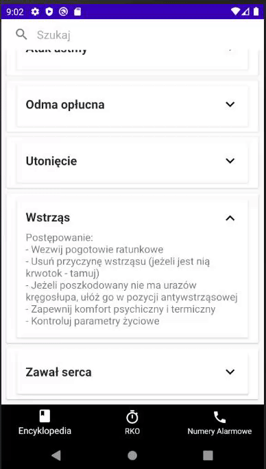
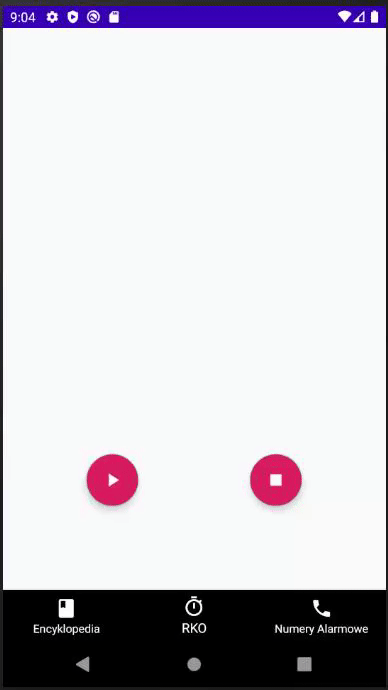
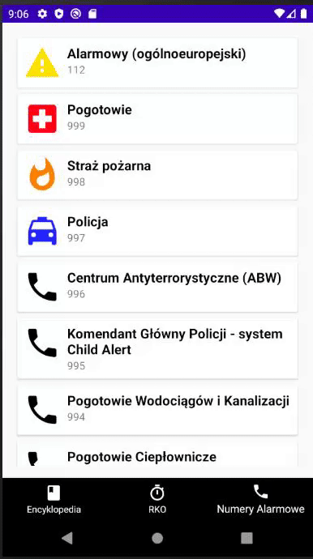

# First Aid Encyclopedia (in progress, only Polish language supported)
Multifunctional Android app using Firestore database written in Kotlin .
## Functionality
- Encyclopedia (Home) Fragment: Filterable RecyclerView with expandable cards connected to Firestore Database

- Timer Fragment: CountDownTimer with sound assistance

- Phone Fragment: RecyclerView of emergency numbers with OnClick functionality

